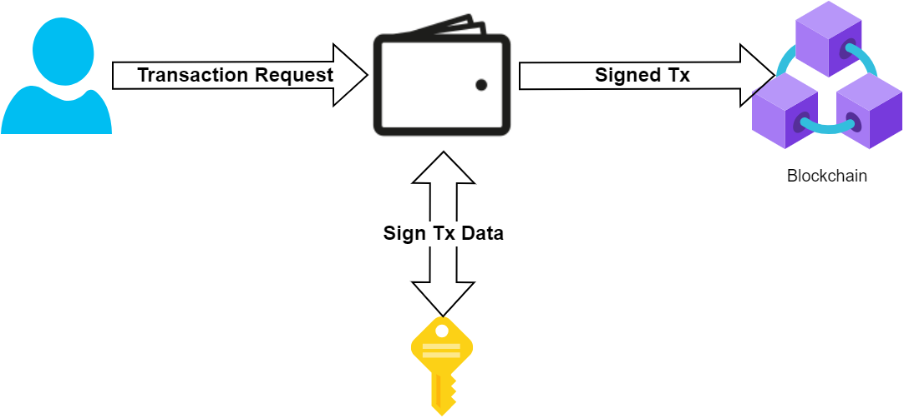
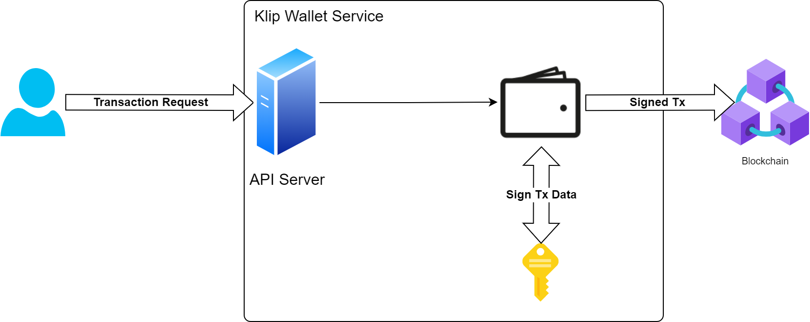

# Architecture

## Background Knowledge

Crypto wallets are application/services that provide a way to interact with the blockchain, hiding sensitive informations such as private keys that are essential to create transactions/sign messages.

Typical EVM-compatitable crypto wallets take the form of a **provider**. Which is a service/application that takes "requests" from the user and takes "actions". Actions include:

1. sending transactions to the blockchain
2. returning signed messages
3. etc.



The typical flow is identical for all EVM-compatiable wallets but the insides have some variations.

For the most significant and common case (e.g. Metamask), JsonRPC is used to interact with the wallet.


[Source](https://betterprogramming.pub/build-your-first-dapp-with-web3-js-9a7306d16a61) from the [Better Programming](https://betterprogramming.pub/) blog.

The DApp (as a form of webapp) triggers/sends a JSONRPC request to the wallet through an interface usually given by the wallet.

The interface ususally takes form of the following kinds:

- A Browser extension that provides a JSONRPC interface
- In-app browser with built-in provider

By using the provided JSONRPC interface, the DApp can utillize the wallet to send transactions, sign messages, etc.

Another form of wallets are server-side wallets. Example of this case is Klip.

Klip processes all transactions on the server-side, concealing the private keys and logic behind the transactions. In the case of Klip, even the calls are typical REST API calls. This greatly simplifies the complexity for the DApp when using the wallet, but also limits the functionality of the wallet we can interact with.

The architecture of Klip is as follows:



## Designing the architecture

### Wallet feature abstraction

The first step is to create an abstraction layer for the wallet.

Most wallets for Ethereum-compatible networks work with providers that follow the [ERC-1193](https://eips.ethereum.org/EIPS/eip-1193) specification. Klaytn network wallets, such as Kaikas, although not fully ERC-1193 compatible, are almost compatible since it is based on the same underlying technology.

The only outlier is Klip. Which is a fully server-side wallet, doesn't have any kind of RPC Provider interface, thus not compatible with the ERC-1193 specification.

Even so, although they have completely different call-flows, we can derive an abstract interface enough to such level where typical DApps use.

...

### Implementation stategy through inheritance and augmentation

The implementation of the abstract layer for every single type of wallet has a lot of boilerplating. This is because most wallets follow the ERC-1193 specification, thus having a `ethereum` provider and using `web3.js` as the helper library.

For example, code to send a transaction for a Metamask wallet and Coinbase wallet is as follows:

> Metamask

```ts
// Metamask wallet
import Web3 from 'web3';

const { ethereum } = window;

const web3 = new Web3(ethereum);

web3.eth.sendTransaction({
  to: '0x...',
  value: 10000,
  gasPrice: '2500000000',
  gasLimit: 21000,
});
```

> Coinbase

```ts
// Coinbase wallet
import Web3 from 'web3';
import CoinbaseWalletSDK from '@coinbase/wallet-sdk';

// Create a provider with the sdk
const coinbaseWallet = new CoinbaseWalletSDK({
  appName: APP_NAME,
  appLogoUrl: APP_LOGO_URL,
  darkMode: false,
});
const coinbaseProvider = coinbaseWallet.makeWeb3Provider(JSONRPC_URL, CHAIN_ID);

const web3 = new Web3(ethereum);

web3.eth.sendTransaction({
  to: '0x...',
  value: 10000,
  gasPrice: '2500000000',
  gasLimit: 21000,
});
```

As seen, only the `ethereum` provider is different for each wallet, and other web3.js calls a identical.

Klaytn provider cases are almost identical as well:

```ts
// Kaikas/Dcent example
import Caver from 'caver';

const { klaytn } = window;

const caver = new Caver(klaytn);

caver.klay.sendTransaction({
  to: '0x...',
  value: 10000,
  gasPrice: '2500000000',
  gasLimit: 21000,
});
```

Thus we can factorize the implementation logics for groups of wallet that share a similar logic in common:

1. Ethereum provider based wallets
2. Klaytn provider based wallets
3. Klip

### Extra interfaces for different wallet formats

Some wallets require different flows to interact with its features. For example, Klip requires the user to direct to a deeplink to trigger an in-app flow, Metamask for mobile devices require the user to route to a deeplink to open the in-app web browser (with a ERC-1193 provider pre-injected).

For cases of accessing mobile wallets from desktop browsers (Walletconnect, Klip), QR Codes are used to trigger a deeplink to the mobile wallet.

These needs are handled by extra interfaces, augmenting the base walletconnector interface.

Examples of these interfaces are:

- IQRConnector
  - interface for wallets that require QR codes to be scanned (for TX or for signing)
  - e.g. for login, TX) Klip, Wallet Connect
  - e.g. for opening in-app browser) Metamask, Dcent,
- IDeepLinkConnector
  - Interface for wallets that utilize deep links to trigger in-app flows
  - e.g. for login, TX) Klip
  - e.g. for opening in-app browser in mobile) Metamask, Dcent,

## Basic class structure (simplified)

Parts of the code are simplified/omitted to make the inheritance structure more clear.


